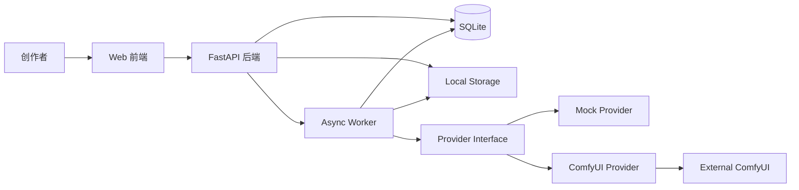
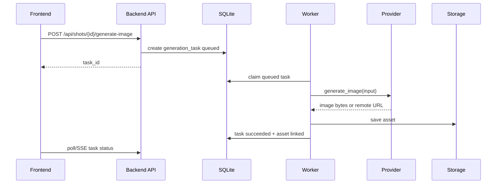

# AI 漫剧平台 MVP 架构方案

## 1. 架构原则

- 业务平台与模型 Provider 解耦。
- 先支持 Mock Provider，再支持 ComfyUI Provider。
- 先做镜头图，不把视频合成放入第一版关键路径。
- SQLite + 本地文件即可支撑 MVP，后续可迁移 PostgreSQL + 对象存储。
- 生成任务必须异步化，前端不等待长请求。
- 所有第三方 API Key 只存在后端或本地配置中。

## 2. 推荐技术栈

为了适合 Codex 分阶段开发，建议使用简单、低摩擦组合：

- 前端：React + Vite + TypeScript + Tailwind CSS + lucide-react。
- 后端：FastAPI + Python 3.11+。
- 数据库：SQLite + SQLModel/SQLAlchemy。
- 任务：MVP 内置 asyncio Worker + DB task table；第二阶段再换 Celery/RQ/Redis。
- 文件存储：本地 `storage/` 目录，后续抽象 S3。
- AI Provider：`MockProvider`、`ComfyUIProvider`。
- 导出：后端生成 Markdown/JSON/ZIP。

也可以选择 Node/Nuxt/Hono，但 FastAPI 对 ComfyUI、图像处理、后台任务更直接，Codex 调试成本更低。

## 3. 总体架构



## 4. 数据库表设计草案

### `projects`

| 字段 | 类型 | 说明 |
| --- | --- | --- |
| `id` | uuid | 主键 |
| `title` | text | 项目名 |
| `description` | text | 简介 |
| `status` | text | `draft/active/archived` |
| `style_preset` | text | 默认画风 |
| `created_at` | datetime | 创建时间 |
| `updated_at` | datetime | 更新时间 |

### `scripts`

| 字段 | 类型 | 说明 |
| --- | --- | --- |
| `id` | uuid | 主键 |
| `project_id` | uuid | 项目 |
| `source_text` | text | 用户输入原文 |
| `structured_json` | json | AI 结构化结果 |
| `version` | int | 版本 |
| `created_at` | datetime | 创建时间 |

### `characters`

| 字段 | 类型 | 说明 |
| --- | --- | --- |
| `id` | uuid | 主键 |
| `project_id` | uuid | 项目 |
| `name` | text | 角色名 |
| `role` | text | 主角/配角/反派等 |
| `personality` | text | 性格 |
| `appearance` | text | 外观 |
| `reference_asset_id` | uuid | 参考图 |
| `voice_profile` | text | 预留 TTS |
| `created_at` | datetime | 创建时间 |

### `scenes`

| 字段 | 类型 | 说明 |
| --- | --- | --- |
| `id` | uuid | 主键 |
| `project_id` | uuid | 项目 |
| `name` | text | 场景名 |
| `description` | text | 场景描述 |
| `mood` | text | 氛围 |

### `shots`

| 字段 | 类型 | 说明 |
| --- | --- | --- |
| `id` | uuid | 主键 |
| `project_id` | uuid | 项目 |
| `scene_id` | uuid | 场景 |
| `order_index` | int | 镜头顺序 |
| `title` | text | 镜头标题 |
| `dialogue` | text | 对白 |
| `narration` | text | 旁白 |
| `visual_prompt` | text | 画面描述 |
| `negative_prompt` | text | 负面提示 |
| `camera` | text | 远景/近景/特写/俯拍 |
| `duration_sec` | float | 时长估算 |
| `selected_asset_id` | uuid | 当前选中镜头图 |
| `status` | text | `draft/ready/generated` |

### `shot_characters`

| 字段 | 类型 | 说明 |
| --- | --- | --- |
| `shot_id` | uuid | 镜头 |
| `character_id` | uuid | 角色 |

### `assets`

| 字段 | 类型 | 说明 |
| --- | --- | --- |
| `id` | uuid | 主键 |
| `project_id` | uuid | 项目 |
| `kind` | text | `image/video/audio/json/export` |
| `source` | text | `upload/generated/export` |
| `path` | text | 本地路径 |
| `url` | text | 前端访问 URL |
| `mime_type` | text | MIME |
| `width` | int | 图片/视频宽 |
| `height` | int | 图片/视频高 |
| `duration_sec` | float | 音视频时长 |
| `meta_json` | json | seed、provider、workflow 等 |
| `created_at` | datetime | 创建时间 |

### `generation_tasks`

| 字段 | 类型 | 说明 |
| --- | --- | --- |
| `id` | uuid | 主键 |
| `project_id` | uuid | 项目 |
| `shot_id` | uuid | 可空，关联镜头 |
| `type` | text | `structure_script/image/video/tts/export` |
| `provider` | text | `mock/comfyui` |
| `status` | text | `queued/running/succeeded/failed/cancelled` |
| `progress` | int | 0-100 |
| `input_json` | json | 任务输入 |
| `output_json` | json | 输出摘要 |
| `error_message` | text | 错误 |
| `created_at` | datetime | 创建 |
| `started_at` | datetime | 开始 |
| `finished_at` | datetime | 结束 |

### `providers`

| 字段 | 类型 | 说明 |
| --- | --- | --- |
| `id` | uuid | 主键 |
| `name` | text | 显示名 |
| `type` | text | `mock/comfyui/openai-compatible` |
| `base_url` | text | 服务地址 |
| `config_json` | json | 非密钥配置 |
| `secret_ref` | text | 密钥引用 |
| `enabled` | bool | 是否启用 |

### `workflow_templates`

| 字段 | 类型 | 说明 |
| --- | --- | --- |
| `id` | uuid | 主键 |
| `provider_type` | text | `comfyui` |
| `name` | text | 模板名 |
| `kind` | text | `image/video/inpaint` |
| `workflow_json` | json | ComfyUI workflow |
| `input_mapping_json` | json | prompt、seed、尺寸、参考图映射 |
| `output_mapping_json` | json | 输出节点映射 |
| `version` | int | 模板版本 |

## 5. API 设计草案

### 项目与基础资源

| 方法 | 路径 | 说明 |
| --- | --- | --- |
| `GET` | `/api/projects` | 项目列表 |
| `POST` | `/api/projects` | 创建项目 |
| `GET` | `/api/projects/{id}` | 项目详情 |
| `PATCH` | `/api/projects/{id}` | 更新项目 |
| `DELETE` | `/api/projects/{id}` | 归档/删除项目 |
| `GET` | `/api/projects/{id}/characters` | 角色列表 |
| `POST` | `/api/projects/{id}/characters` | 创建角色 |
| `PATCH` | `/api/characters/{id}` | 更新角色 |
| `GET` | `/api/projects/{id}/shots` | 分镜列表 |
| `POST` | `/api/projects/{id}/shots` | 创建分镜 |
| `PATCH` | `/api/shots/{id}` | 更新分镜 |
| `POST` | `/api/shots/reorder` | 重排分镜 |

### 生成与任务

| 方法 | 路径 | 说明 |
| --- | --- | --- |
| `POST` | `/api/projects/{id}/script/structure` | 创建剧本结构化任务 |
| `POST` | `/api/shots/{id}/generate-image` | 创建镜头图生成任务 |
| `GET` | `/api/tasks` | 任务列表 |
| `GET` | `/api/tasks/{id}` | 任务详情 |
| `POST` | `/api/tasks/{id}/retry` | 重试任务 |
| `POST` | `/api/tasks/{id}/cancel` | 取消任务 |
| `GET` | `/api/tasks/{id}/events` | SSE 任务进度 |

### Provider 与工作流

| 方法 | 路径 | 说明 |
| --- | --- | --- |
| `GET` | `/api/providers` | Provider 列表 |
| `POST` | `/api/providers` | 新建 Provider |
| `PATCH` | `/api/providers/{id}` | 更新 Provider |
| `POST` | `/api/providers/{id}/test` | 连通性测试 |
| `GET` | `/api/workflow-templates` | 工作流模板列表 |
| `POST` | `/api/workflow-templates` | 创建模板 |
| `PATCH` | `/api/workflow-templates/{id}` | 更新模板 |

### 素材与导出

| 方法 | 路径 | 说明 |
| --- | --- | --- |
| `GET` | `/api/projects/{id}/assets` | 素材列表 |
| `POST` | `/api/projects/{id}/assets/upload` | 上传素材 |
| `GET` | `/api/assets/{id}` | 素材详情 |
| `GET` | `/api/assets/{id}/file` | 下载/预览文件 |
| `POST` | `/api/projects/{id}/exports` | 创建导出任务 |

## 6. AI 生成链路设计

### 6.1 剧本结构化链路

MVP 可先用 Mock 或后端规则生成结构化结果，后续接入 LLM。

输入：

- 项目原文。
- 目标集数/镜头数。
- 默认风格。

输出：

- 角色列表。
- 场景列表。
- 分镜列表。

结构化输出示例：

```json
{
  "characters": [
    {
      "name": "林夏",
      "role": "主角",
      "appearance": "短发，蓝色外套，表情坚定"
    }
  ],
  "scenes": [
    {
      "name": "雨夜街角",
      "description": "霓虹灯反射在积水中，城市冷色调"
    }
  ],
  "shots": [
    {
      "order_index": 1,
      "visual_prompt": "雨夜街角，林夏回头看向镜头，漫画风，电影感构图",
      "dialogue": "终于找到你了。",
      "camera": "medium close-up"
    }
  ]
}
```

### 6.2 镜头图生成链路



## 7. Provider 扩展设计

### 7.1 Provider 接口

```text
Provider
- test_connection() -> ProviderHealth
- generate_image(input: ImageGenerationInput) -> GenerationResult
- generate_video(input: VideoGenerationInput) -> GenerationResult
- generate_tts(input: TtsGenerationInput) -> GenerationResult
```

MVP 只实现 `generate_image`，其他方法抛出 `NotImplemented` 并保留类型。

### 7.2 Mock Provider

用途：

- 开发无模型依赖。
- 演示流程。
- 测试任务状态、失败重试、文件写入。

行为：

- `generate_image` 返回一张 SVG/PNG 占位图，包含 shot title、provider、时间戳。
- 可通过输入参数 `simulate_error=true` 模拟失败。
- 可通过 `delay_ms` 模拟慢任务。

注意：即使 Mock 生成占位图，也要走完整 task/asset/storage 链路。

### 7.3 ComfyUI Provider

配置项：

- `base_url`：如 `http://127.0.0.1:8188`。
- `workflow_template_id`。
- `timeout_sec`。
- `output_node_ids`。
- `input_mapping_json`：将业务字段映射到 workflow 节点。

调用流程：

1. 读取 workflow template。
2. 将 `visual_prompt`、`negative_prompt`、`width`、`height`、`seed`、角色参考图路径注入 workflow。
3. `POST /prompt` 提交任务。
4. 使用 WebSocket 或轮询 history 获取状态。
5. 下载/读取输出图片。
6. 保存为 Asset，记录 workflow、prompt_id、seed、节点输出。

错误处理：

- ComfyUI 不可达：任务失败，错误为 `provider_unreachable`。
- workflow 映射失败：任务失败，错误为 `invalid_workflow_mapping`。
- 输出节点缺失：任务失败，保留 ComfyUI 原始响应。
- 超时：任务失败，可重试。

## 8. 文件存储设计

目录建议：

```text
storage/
  projects/
    {project_id}/
      uploads/
      generated/
        images/
        videos/
        audio/
      exports/
  tmp/
```

原则：

- 数据库存相对路径和 MIME，不直接存大文件。
- 上传文件先写 `tmp`，校验后移动到项目目录。
- 生成结果统一复制进平台存储，不依赖 Provider 临时路径。
- 导出产物也作为 Asset 保存。

未来扩展：

- `StorageProvider` 增加 `LocalStorage`、`S3Storage`。
- Asset URL 由后端生成，避免数据库存绝对公网 URL。

## 9. 测试计划

### 单元测试

- Provider input mapping。
- Mock Provider 生成结果。
- 文件存储路径安全。
- 任务状态流转。
- 数据模型 CRUD。

### 集成测试

- 创建项目 → 创建角色 → 创建分镜 → Mock 生成图片 → 导出 JSON。
- 失败任务 → 重试成功。
- 上传参考图 → 绑定角色 → 镜头生成任务读取引用。

### ComfyUI 可选集成测试

- 环境变量提供 `COMFYUI_BASE_URL` 时运行。
- 测试 `/system_stats` 或类似连通性。
- 用最小 workflow 生成一张低分辨率图。

### 前端测试

- 项目列表渲染。
- 分镜表单编辑。
- 任务状态刷新。
- Provider 设置表单校验。

### 手工验收

- 无 ComfyUI 情况下完整跑通 Mock。
- 配置错误 ComfyUI 时错误提示清晰。
- 生成产物刷新后仍可查看。
- 导出文件内容包含角色、分镜、素材路径。

## 10. 开发里程碑

### M0：文档与骨架

- 确定技术栈。
- 初始化项目结构。
- 配置格式化、测试、基础 CI。

### M1：后端核心模型

- SQLite 模型与迁移。
- 项目、角色、分镜、素材 CRUD。
- 本地文件存储。

### M2：任务系统与 Mock Provider

- 任务表。
- 后台 Worker。
- Mock 图片生成。
- 任务中心 API。

### M3：前端 MVP

- 项目列表。
- 项目工作台。
- 角色页。
- 分镜页。
- 任务中心。
- 素材预览。

### M4：ComfyUI Provider

- Provider 设置。
- 连通性测试。
- Workflow 模板。
- 生成图片并归档。

### M5：导出与验收

- Markdown/JSON/ZIP 导出。
- 端到端测试。
- README 和本地运行文档。
